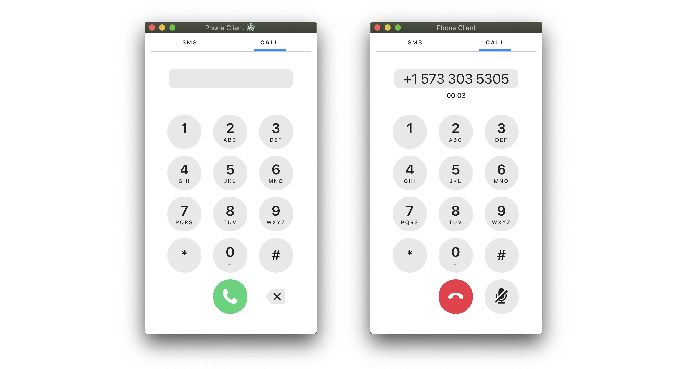

# Twilio Phone Client

## Table of contents

  * [Introduction](#introduction)
    + [Notable features](#notable-features)
  * [Installation](#installation)
  * [ToDo](#todo)
  * [Screenshots](#screenshots)
    + [SMS](#sms)
    + [Call](#call)

## Introduction

This is a web client providing easy access to SMS and call capabilities of a Twilio phone number.

The SMS part is built on top of Twilio's [Programmable Chat API](https://www.twilio.com/docs/chat).

This repository consists of two parts:

```
/src/               # the frontend React app
/deploy/functions/  # supporting backend scripts, to be deployed as Twilio Functions
```

The npm `deploy` command utilizes [Twilio CLI](https://www.twilio.com/docs/twilio-cli/quickstart) to deploy both the frontend and backend to [Twilio Runtime](https://www.twilio.com/docs/runtime/functions-assets-api).


### Notable features

 * SMS: Infitinty scolling (older messages get loaded automatically as one scrolls up in a thread)
 * SMS: Hovering over message timestamp displays tooltip with additional details of each message including its [SID](https://www.twilio.com/docs/glossary/what-is-a-sid)
 * Configurable accent color (see `REACT_APP_ACCENT_COLOR` in `/.env`)


## Installation

Before you start, make sure you have [Twilio CLI](https://www.twilio.com/docs/twilio-cli/quickstart) and its [serverless plugin](https://www.twilio.com/docs/twilio-cli/plugins#available-plugins) installed and working.

Then there are couple things that need to be prepared before the installation:

1. Note down your [Account SID and Auth Token](https://www.twilio.com/console)
2. Create and note down [API key & secret](https://www.twilio.com/console/project/api-keys)
3. Create a [Programmable Chat Service](https://www.twilio.com/console/chat/services) and note down its SID

```
$ npm install                    # install React dependencies
$ cd deploy; npm install; cd ..  # install Twilio Runtime dependencies
$ npm run deploy                 # test deploy your application to get its public URLs
...
Functions:
   [protected] https://twilio-phone-client-XXXX-dev.twil.io/callOutbound <<< note down the /callOutbound URL
   [protected] https://twilio-phone-client-XXXX-dev.twil.io/msgInbound   <<< note down the /msgInbound URL
   https://twilio-phone-client-XXXX-dev.twil.io/getAccessToken
   https://twilio-phone-client-XXXX-dev.twil.io/getCapToken
   https://twilio-phone-client-XXXX-dev.twil.io/msgOutbound

```

Your phone client will **not work** at this point.

4. Purchase a [Twilio phone number](https://www.twilio.com/console/phone-numbers/incoming) and note it down (if you plan to use both SMS and calls, make sure your phone number has both capabilities). In the phone number's configuration, set the "A Message Comes In" Webhook to the `/msgInbound` URL you have collected above.


5. Create a new [TwiML App](https://www.twilio.com/console/voice/twiml/apps) and set its Voice Request URL to the `/callOutbound` URL you have noted in the previous step. Save it and then go back to the TwiML App's configuration and note down its SID.


6. Save the collected information and deploy

```
$ cp deploy/.env.sample deploy/.env
$ vim deploy/.env   # fill in information collected in the previous steps
ACCOUNT_SID=ACxxx
AUTH_TOKEN=xxx
SYNC_API_KEY=SKxxx
SYNC_API_SECRET=xxx
CHAT_SERVICE_SID=ISxxx
TWILIO_NUMBER=+1xxx
TWIML_APP_SID=APxxx

$ npm run deploy    # deploy your application for the 2nd time
...
Assets:
   https://twilio-phone-client-XXXX-dev.twil.io/asset-manifest.json
   https://twilio-phone-client-XXXX-dev.twil.io/favicon.ico
   https://twilio-phone-client-XXXX-dev.twil.io/index.html  <<< this is your client's URL
   ...
```

7. Now you can open the deployed `index.html` URL in your web browser and start your phone client.

**Pro tip:** To run the client in its own resizable window with minimal window chrome, you can use something like this:

MacOS: ```/Applications/Google\ Chrome.app/Contents/MacOS/Google\ Chrome --app="https://twilio-phone-client-XXXX-dev.twil.io/index.html"```

Windows: ```chrome --app="https://twilio-phone-client-XXXX-dev.twil.io/index.html"```

## ToDo

 * Add support for inbound calls (currently only outbound calls are supported)
 * Add support for Multimedia Messages (MMS) for both inbound and outbound
 * Add call history and allow quick redials
 * Add ability to delete SMS threads from within the client

## Screenshots

### SMS


### Call

